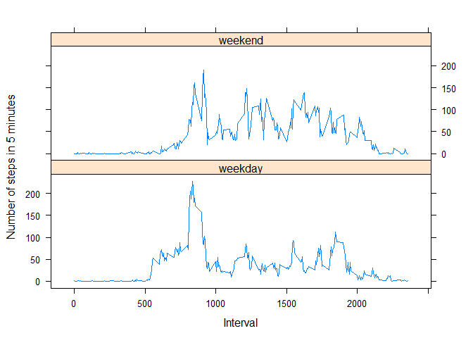

# Reproducible Research: Peer Assessment 1


## Loading and preprocessing the data

Make sure we have the needed packages loaded - this analysis requires dplyr, lattice and ggplot2

```r
if ( !(require(dplyr) && require(lattice) && require(ggplot2)) ) {
    stop ("You need to install the dplyr, lattice and ggplot2 packages to run this script")
}
```

Unzip and read the activity data file. Convert the date column into a date. Keep the interval column as a number, we will add a date representaiton as needed for plotting

```r
actMonRaw <- read.csv( unz('activity.zip','activity.csv'))
actMon <- tbl_df(actMonRaw) %>%
    mutate( date = as.Date(date) ) 
```

## What is mean total number of steps taken per day?
Calculate the number of steps taken each day by taking the sum of the number of steps in each 5 minute interval during the day. Missing values are ignored in this part.

```r
dailySteps <- actMon %>%
    group_by( date ) %>%
    summarize( steps = sum(steps, na.rm=TRUE) )
```

Let's see a histogram of the number of steps per day
 

The mean number of steps taken each day is 9354.23 (shown above). The median is 10395. For calculating these numbers, the number of steps on days with no readings is 0. if we exclude those days the results are 10766.19 for the mean and 10765 for the median.


## What is the average daily activity pattern?

Find the average number of steps in each 5 minute interval, ignoring missing values.
We'll count the number of days data was actually collected for each interval, and use that in the average.

```r
intervalSteps <- actMon %>%
    group_by( interval ) %>%
    summarize( daysCollected = sum(!is.na(steps)), steps = sum(steps, na.rm=TRUE) )
intervalSteps$intervalTime=strptime( sprintf("%04d",intervalSteps$interval),  format="%H%M")
```

The average steps within each interval

 

The interval that contains, on average, the maximum number of steps starts at 
08:35.

## Imputing missing values

There are 2304 missing values for the step counts. This represents
13.11%
of the data. How do these missing values impact the data? Extracting just the missing values:

```r
missing <- actMon[is.na(actMon$steps),]
```
 

We observe that the missing values are distributed evenly thoughout the day, with only a slight variation around midnight (when the number of steps is low), so the missing values are assumed to not significantly affect the distribution of steps thoughout the day. How do the missing values distribute over the days?

 

Most days do not have any missing values, the ones that do are missing the same number - possibly all 288 of them. We can see the numbers:


```r
table(missing$date)
```

```
## 
## 2012-10-01 2012-10-08 2012-11-01 2012-11-04 2012-11-09 2012-11-10 
##        288        288        288        288        288        288 
## 2012-11-14 2012-11-30 
##        288        288
```

On the above 8 days no measurements are available. The other days are not missing any readings. This suggests a smoothing, using the mean of the neighboring days, will give reasonable values to impute the missing data - except there are three conditions which prevent such a simple approach:

1. There may be (and in fact, are) two consecutive dates with missing data. To handle this situation, our rule is to take the days before and after, skipping over days with missing data
1. A day with missing data may be (and in fact, is) the first or last day for data collection. These days may be discarded, since imputing values here would add nothing.
1. The neighboring dates may have non-representative data. Consider November 15, the neighnor to a date with missing data (November 14):

```r
table( actMon[actMon$date=="2012-11-15",1] )
```

```
## 
##   0   8  33 
## 286   1   1
```
There are only two 5 minute intervals that date with any movement recorded - possibly a correct reading of the subject's activity, but using this to contribute 50% of an imputed value will amplify the effect of this non-representive day.
This is not the only date where an unrealistic number of the readings are 0. Consider October 2 (the first date on which any readings are available).

```r
table( actMon[actMon$date=="2012-10-02",1] )
```

```
## 
##   0   9 117 
## 286   1   1
```
We can reduce the impact by smoothing over more neighbors (alternatively the global means for each interval could be used),

Since we know that if any reading is missing for a day, then all the readings are missing for that day, we can simplify the processing. We start with the boundary conditions, removing rows for the first and last dates until these are not missing the steps reading. The code is also simplified because we know that the data frame is in date order.

First we will copy into a new frame and remove the days at boundaries of the date range where no readings were collected


```r
actMonImp <- actMon
while ( is.na(actMonImp[1,1]) ) { 
    removeDate <- actMonImp[1,2]
    actMonImp <- actMonImp[!(actMonImp$date==removeDate[[1]]),]
}
while ( is.na(actMonImp[dim(actMonImp)[1],1]) ) { 
    removeDate <- actMonImp[dim(actMonImp)[1],2]
    actMonImp <- actMonImp[!(actMonImp$date==removeDate[[1]]),]
}
```

Then we will smooth the remaining missing data with the mean of the readings from the nearest days before and day after that have actual readings. To help with this we will create a vector containing the dates with missing data that we need to impute.


```r
missingDays <- unique(actMonImp[is.na(actMonImp[,1]),2])[[1]]
```

Define a helper function to make the code a little clearer. This will return the date with non-missing data closest to the specified date in the indicated direction.


```r
dayWithData <- function( df, d, dir ) {
    while ( is.na(df[df$date==d & df$interval==0,1]) ) {
        d = d + dir*1
    }
    
    d
}
```

Loop through the days with missing data and impute using the means of the two nearest neighbors in each direction. Note that the original (non-imputed) frame is used to determine the neighboring days to use - this avoids having the results affected by application of this step to a prior day in the loop.


```r
for (d in 1:length(missingDays) ) {
    dayBefore <- dayWithData( actMon, missingDays[d], -1 )
    twoDaysBefore <- dayWithData( actMon, dayBefore, -1 )
    dayAfter <-  dayWithData( actMon, missingDays[d], +1 )
    twoDaysAfter <-  dayWithData( actMon, dayAfter, +1 )
    actMonImp[actMonImp$date==missingDays[d],]$steps =
        (actMonImp[actMonImp$date==twoDaysBefore,]$steps +
        actMonImp[actMonImp$date==dayBefore,]$steps +
        actMonImp[actMonImp$date==dayAfter,]$steps +
        actMonImp[actMonImp$date==twoDaysAfter,]$steps ) / 4
}
```

Now make a histogram with the imputed data included and compare the mean and median with the original results. First we need to recalculate the daily totals.


```r
dailySteps <- actMonImp %>%
    group_by( date ) %>%
    summarize( steps = sum(steps, na.rm=TRUE) )
```

The histogram of the number of steps per day with the imputed data

 

The spike at 0, which was due to the missing data causing the affected days to show a zero total, is gone. The mean number of steps taken each day is 10602.52 (shown above). The median is 10600. These are closer to the original values with the missing days excluded than with those daily totals being with as 0, as would be expected.

## Are there differences in activity patterns between weekdays and weekends?

Continuing to work with the dataset which includes the imputed missing values, create a new factor variable in the dataset with two levels - "weekday" and "weekend" indicating whether a given date is a weekday or weekend day. Find the average number of steps in each 5 minute interval, grouped by weekdays and weekends. We know, since we imputed all the missing values, that there are no NA's and there is no variation in the number of days data was collected within the weekday and weekend readings, so we only need two number for the denominators


```r
actMonImp$dayType <- factor(
    ifelse( 
        weekdays(actMonImp$date, abbreviate=TRUE) %in% c('Sat','Sun'), 
        'weekend', 
        'weekday'
        ) 
    )

intervalSteps <- actMonImp %>%
    group_by( dayType, interval ) %>%
    summarize( steps = sum(steps) )
intervalSteps$intervalTime=strptime( sprintf("%04d",intervalSteps$interval),  format="%H%M")

daysCollected <- unique(actMonImp[,c(2,4)]) %>%
    group_by(dayType) %>%
    summarize(numberDays=length(date))
```

Let's see how the daily activity patterns compares between weekdays and weekends:

 
